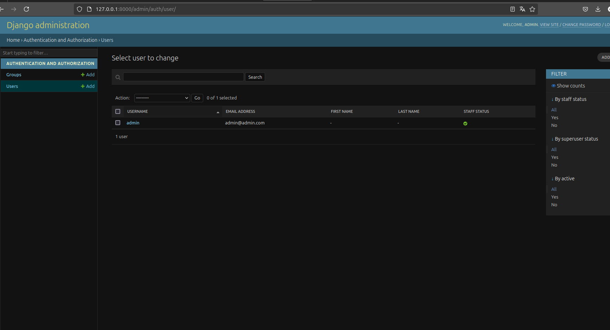
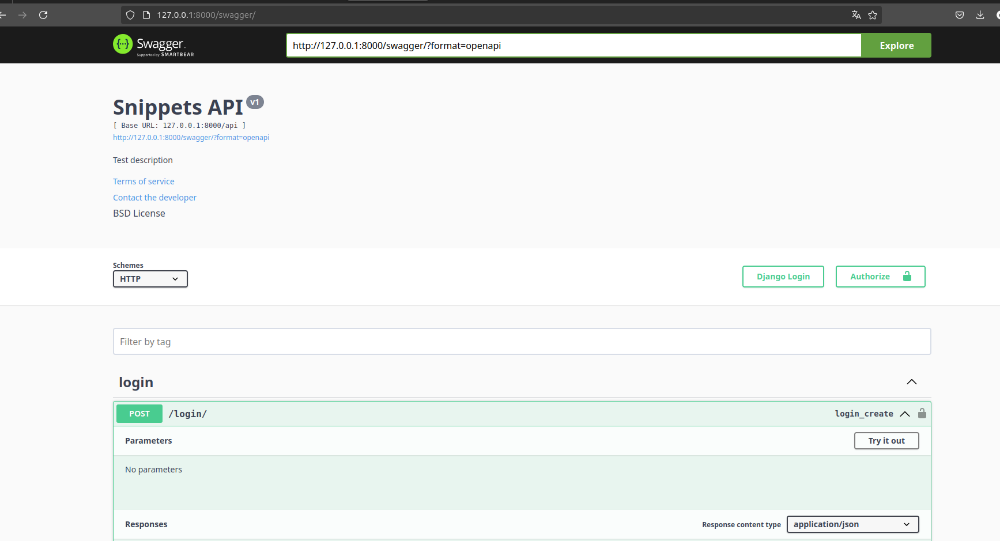

# artri-app-api


## Pré-requisitos

ertifique-se de ter os seguintes itens instalados em seu ambiente

- **Python 3.12**
- **pip** 

## Passos para Instalação

### 1. Clonar o Repositório

Clone o repositório

```bash
git clone https://github.com/artri-app/artri-app-api
cd artri-app-api

python3 -m venv venv
source venv/bin/activate

pip install -r requirements.txt

python manage.py migrate

python manage.py runserver

```
caso deseje criar um novo usuario
``  python manage.py createsuperuser ``

Caso queira acessar o painel de administradores
http://127.0.0.1:8000/admin/



## Acessar o Swagger para ver a documentação gerada ou testar a API

http://127.0.0.1:8000/swagger/
